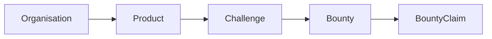
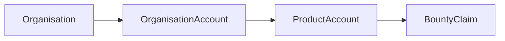

# Platform Schema Documentation

## Overview

This document outlines the key models and their relationships in the platform.

### Key Areas
- **Products & Challenges**: Core business objects
- **Users & Organizations**: Account management
- **Payments & Rewards**: Financial transactions
- **Skills & Expertise**: Talent management

## Core Concepts

### Product Flow

### Payment Flow

## Core Models

### Product
Represents a product in the platform that organizations can create and manage.
#### Key Fields
| Field | Type | Description | Rules |
|-------|------|-------------|--------|
| attachments | ManyToManyField | Product files and documents | References: FileAttachment |
| organisation | ForeignKey | Owning organization | References: Organisation |
| visibility | CharField | Access control | Choices: Global, Organisation Only, Restricted |

### Challenge
Represents a specific task or goal within a product.
#### Key Fields
| Field | Type | Description | Rules |
|-------|------|-------------|--------|
| product | ForeignKey | Parent product | References: Product |
| priority | CharField | Task priority | Choices: High, Medium, Low |
| status | CharField | Current state | Choices: Draft, Active, Completed |
| reward_type | CharField | Reward type | Choices: Liquid Points, Non Liquid Points |

### Bounty
Represents a reward offered for completing a challenge.
#### Key Fields
| Field | Type | Description | Rules |
|-------|------|-------------|--------|
| challenge | ForeignKey | Parent challenge | References: Challenge |
| claimed_by | ForeignKey | Claiming user | References: Person |
| expertise | ManyToManyField | Required expertise | References: Expertise |
| status | CharField | Current state | Choices: Available, Claimed, Completed |

### User
Platform user account.
#### Key Fields
| Field | Type | Description | Rules |
|-------|------|-------------|--------|
| username | CharField | Unique username | Required, Unique |
| is_active | BooleanField | Account status | Required |
| groups | ManyToManyField | User groups | References: Group |

### Organisation
Represents a company or team.
#### Key Fields
| Field | Type | Description | Rules |
|-------|------|-------------|--------|
| name | CharField | Organization name | Required |
| owner | ForeignKey | Organization owner | References: Person |
| status | CharField | Current state | Choices: Active, Inactive |

### OrganisationAccount
Financial account for an organization.
#### Key Fields
| Field | Type | Description | Rules |
|-------|------|-------------|--------|
| organisation | ForeignKey | Parent organization | References: Organisation |
| balance | DecimalField | Current balance | Required |
| status | CharField | Account status | Choices: Active, Frozen |

### Skill
Represents a specific skill or capability.
#### Key Fields
| Field | Type | Description | Rules |
|-------|------|-------------|--------|
| name | CharField | Skill name | Required |
| parent | ForeignKey | Parent skill | References: Skill |
| level | IntegerField | Skill level | Range: 1-5 |

### Expertise
Represents expertise in a skill area.
#### Key Fields
| Field | Type | Description | Rules |
|-------|------|-------------|--------|
| skill | ForeignKey | Related skill | References: Skill |
| person | ForeignKey | Expert user | References: Person |
| level | CharField | Expertise level | Choices: Beginner, Intermediate, Expert |
