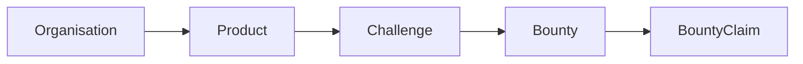
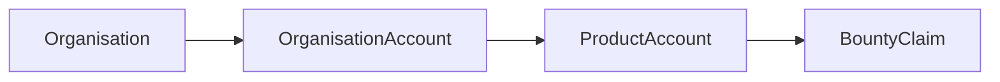
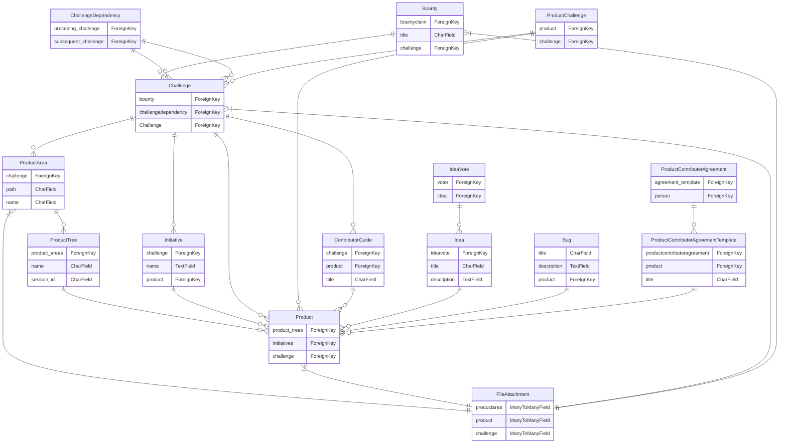
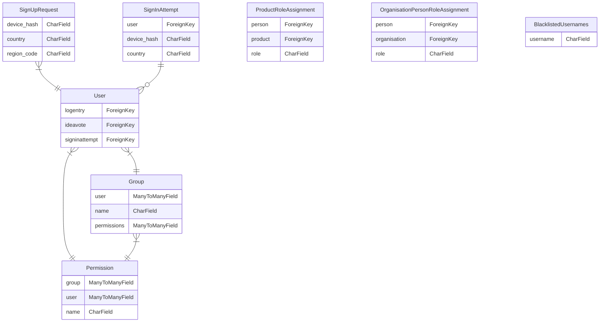
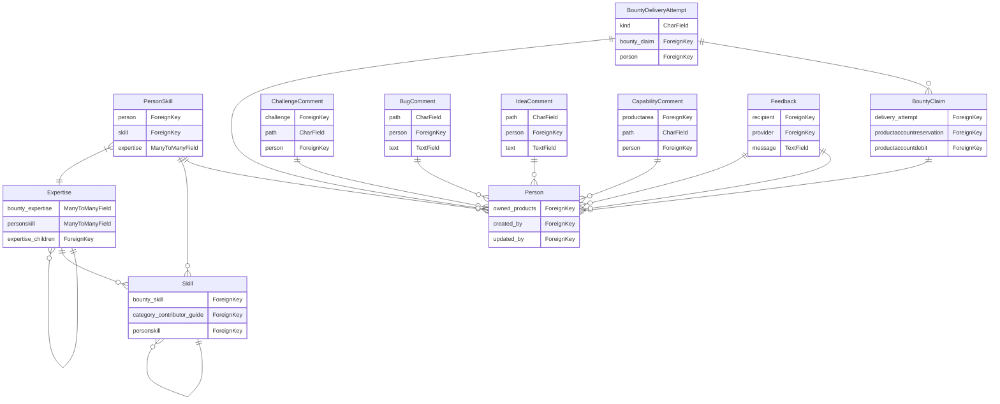

# Platform Schema Documentation

## Overview

This document outlines the key models and their relationships in the platform.

### Key Areas
- **Products & Challenges**: Core business objects
- **Users & Organizations**: Account management
- **Payments & Rewards**: Financial transactions
- **Skills & Expertise**: Talent management

## Core Concepts

### Product Flow

### Payment Flow

## Core

### Key Relationships

### Bounty

Represents a reward offered for completing a specific challenge.
#### Key Fields
| Field | Type | Description | Rules |
|-------|------|-------------|--------|
| attachments | ManyToManyField | _No description_ | References: FileAttachment, Required |
| challenge | ForeignKey | _No description_ | References: Challenge, Required |
| claimed_by | ForeignKey | _No description_ | References: Person |
| expertise | ManyToManyField | _No description_ | References: Expertise, Required |
| skill | ForeignKey | _No description_ | References: Skill |
| status | CharField | _No description_ | Choices: Available, Claimed, In Review, Completed, Cancelled, Required |

#### Relationships
- **References** Challenge
- **References** Skill
- **References** Person
- **References** FileAttachment
- **References** Expertise
- **Has Many** BountyClaim

#### Meta
- **Default Ordering:** ['-created_at']

### Bug

#### Key Fields
| Field | Type | Description | Rules |
|-------|------|-------------|--------|
| person | ForeignKey | _No description_ | References: Person, Required |
| product | ForeignKey | _No description_ | References: Product, Required |

#### Relationships
- **References** Product
- **References** Person

### Challenge

Represents a specific task or goal within a product that needs to be accomplished.
#### Key Fields
| Field | Type | Description | Rules |
|-------|------|-------------|--------|
| attachments | ManyToManyField | _No description_ | References: FileAttachment, Required |
| comments_start | ForeignKey | _No description_ | References: ChallengeComment |
| contribution_guide | ForeignKey | _No description_ | References: ContributorGuide |
| created_by | ForeignKey | _No description_ | References: Person |
| initiative | ForeignKey | _No description_ | References: Initiative |
| priority | CharField | _No description_ | Choices: High, Medium, Low, Required |
| product | ForeignKey | _No description_ | References: Product |
| product_area | ForeignKey | _No description_ | References: ProductArea |
| reward_type | CharField | _No description_ | Choices: Liquid Points, Non Liquid Points, Required |
| status | CharField | _No description_ | Choices: Draft, Blocked, Active, Completed, Cancelled, Required |
| updated_by | ForeignKey | _No description_ | References: Person |

#### Relationships
- **References** Initiative
- **References** ProductArea
- **References** Person
- **References** Person
- **References** ChallengeComment
- **References** Product
- **References** ContributorGuide
- **References** FileAttachment
- **Has Many** Bounty
- **Has Many** ChallengeDependency
- **Has Many** ChallengeDependency
- **Has Many** ProductChallenge

### ChallengeDependency

#### Key Fields
| Field | Type | Description | Rules |
|-------|------|-------------|--------|
| preceding_challenge | ForeignKey | _No description_ | References: Challenge, Required |
| subsequent_challenge | ForeignKey | _No description_ | References: Challenge, Required |

#### Relationships
- **References** Challenge
- **References** Challenge

### ContributorGuide

#### Key Fields
| Field | Type | Description | Rules |
|-------|------|-------------|--------|
| product | ForeignKey | _No description_ | References: Product, Required |
| skill | ForeignKey | _No description_ | References: Skill |

#### Relationships
- **References** Product
- **References** Skill
- **Has Many** Challenge

### FileAttachment

#### Relationships
- **Many to Many** ProductArea
- **Many to Many** Product
- **Many to Many** Challenge
- **Many to Many** Bounty
- **Many to Many** BountyDeliveryAttempt

### Idea

#### Key Fields
| Field | Type | Description | Rules |
|-------|------|-------------|--------|
| person | ForeignKey | _No description_ | References: Person, Required |
| product | ForeignKey | _No description_ | References: Product, Required |

#### Relationships
- **References** Product
- **References** Person
- **Has Many** IdeaVote

### IdeaVote

#### Key Fields
| Field | Type | Description | Rules |
|-------|------|-------------|--------|
| idea | ForeignKey | _No description_ | References: Idea, Required |
| voter | ForeignKey | _No description_ | References: User, Required |

#### Relationships
- **References** User
- **References** Idea

#### Meta
- **Unique Together:** [['voter', 'idea']]

### Initiative

#### Key Fields
| Field | Type | Description | Rules |
|-------|------|-------------|--------|
| product | ForeignKey | _No description_ | References: Product, Required |
| status | CharField | _No description_ | Choices: Draft, Active, Completed, Cancelled, Required |

#### Relationships
- **References** Product
- **Has Many** Challenge

### Product

Represents a product in the platform that organizations can create and manage.
#### Key Fields
| Field | Type | Description | Rules |
|-------|------|-------------|--------|
| attachments | ManyToManyField | _No description_ | References: FileAttachment, Required |
| organisation | ForeignKey | _No description_ | References: Organisation |
| person | ForeignKey | _No description_ | References: Person |
| visibility | CharField | _No description_ | Choices: Global, Organisation Only, Restricted, Required |

#### Relationships
- **References** Person
- **References** Organisation
- **References** FileAttachment
- **Has Many** ProductTree
- **Has Many** Initiative
- **Has Many** Challenge
- **Has Many** ProductChallenge
- **Has Many** ContributorGuide
- **Has Many** Idea
- **Has Many** Bug
- **Has Many** ProductContributorAgreementTemplate
- **Has Many** ProductRoleAssignment
- **Has Many** ProductAccount

### ProductArea

#### Key Fields
| Field | Type | Description | Rules |
|-------|------|-------------|--------|
| attachments | ManyToManyField | _No description_ | References: FileAttachment, Required |
| comments_start | ForeignKey | _No description_ | References: CapabilityComment |
| product_tree | ForeignKey | _No description_ | References: ProductTree |

#### Relationships
- **References** ProductTree
- **References** CapabilityComment
- **References** FileAttachment
- **Has Many** Challenge

### ProductChallenge

#### Key Fields
| Field | Type | Description | Rules |
|-------|------|-------------|--------|
| challenge | ForeignKey | _No description_ | References: Challenge, Required |
| product | ForeignKey | _No description_ | References: Product, Required |

#### Relationships
- **References** Product
- **References** Challenge

### ProductContributorAgreement

#### Key Fields
| Field | Type | Description | Rules |
|-------|------|-------------|--------|
| agreement_template | ForeignKey | _No description_ | References: ProductContributorAgreementTemplate, Required |
| person | ForeignKey | _No description_ | References: Person, Required |

#### Relationships
- **References** ProductContributorAgreementTemplate
- **References** Person

### ProductContributorAgreementTemplate

#### Key Fields
| Field | Type | Description | Rules |
|-------|------|-------------|--------|
| created_by | ForeignKey | _No description_ | References: Person, Required |
| product | ForeignKey | _No description_ | References: Product, Required |

#### Relationships
- **References** Product
- **References** Person
- **Has Many** ProductContributorAgreement

#### Meta
- **Default Ordering:** ['-created_at']

### ProductTree

#### Key Fields
| Field | Type | Description | Rules |
|-------|------|-------------|--------|
| product | ForeignKey | _No description_ | References: Product |

#### Relationships
- **References** Product
- **Has Many** ProductArea

#### Meta
- **Default Ordering:** ['-created_at']

## Users

### Key Relationships

### BlacklistedUsernames

### Group

#### Key Fields
| Field | Type | Description | Rules |
|-------|------|-------------|--------|
| permissions | ManyToManyField | _No description_ | References: Permission, Required |

#### Relationships
- **References** Permission
- **Many to Many** User

### OrganisationPersonRoleAssignment

#### Key Fields
| Field | Type | Description | Rules |
|-------|------|-------------|--------|
| organisation | ForeignKey | _No description_ | References: Organisation, Required |
| person | ForeignKey | _No description_ | References: Person, Required |
| role | CharField | _No description_ | Choices: Owner, Manager, Member, Required |

#### Relationships
- **References** Person
- **References** Organisation

#### Meta
- **Unique Together:** [['person', 'organisation']]

### Permission

#### Key Fields
| Field | Type | Description | Rules |
|-------|------|-------------|--------|
| content_type | ForeignKey | _No description_ | References: ContentType, Required |

#### Relationships
- **References** ContentType
- **Many to Many** Group
- **Many to Many** User

#### Meta
- **Unique Together:** [['content_type', 'codename']]
- **Default Ordering:** ['content_type__app_label', 'content_type__model', 'codename']

### ProductRoleAssignment

#### Key Fields
| Field | Type | Description | Rules |
|-------|------|-------------|--------|
| person | ForeignKey | _No description_ | References: Person, Required |
| product | ForeignKey | _No description_ | References: Product, Required |
| role | CharField | _No description_ | Choices: Member, Manager, Admin, Required |

#### Relationships
- **References** Person
- **References** Product

### SignInAttempt

#### Key Fields
| Field | Type | Description | Rules |
|-------|------|-------------|--------|
| user | ForeignKey | _No description_ | References: User, Required |

#### Relationships
- **References** User

### SignUpRequest

#### Key Fields
| Field | Type | Description | Rules |
|-------|------|-------------|--------|
| user | OneToOneField | _No description_ | References: User |

#### Relationships
- **Has One** User

### User

#### Key Fields
| Field | Type | Description | Rules |
|-------|------|-------------|--------|
| groups | ManyToManyField | The groups this user belongs to. A user will get all permissions granted to each of their groups. | References: Group, Required |
| is_active | BooleanField | Designates whether this user should be treated as active. Unselect this instead of deleting accounts. | Required |
| is_staff | BooleanField | Designates whether the user can log into this admin site. | Required |
| is_superuser | BooleanField | Designates that this user has all permissions without explicitly assigning them. | Required |
| user_permissions | ManyToManyField | Specific permissions for this user. | References: Permission, Required |
| username | CharField | Required. 150 characters or fewer. Letters, digits and @/./+/-/_ only. | Required |

#### Relationships
- **References** Group
- **References** Permission
- **Has Many** LogEntry
- **Has Many** IdeaVote
- **Has Many** SignInAttempt
- **Has Many** UserSocialAuth

## Payments

### Key Relationships

```mermaid
erDiagram
    Organisation {
        owned_products ForeignKey
        person_role_assignments ForeignKey
        organisationaccount ForeignKey
    }
    OrganisationAccountCredit {
        grant ForeignKey
        salesorder ForeignKey
        organisation_account ForeignKey
    }
    OrganisationAccount {
        organisationaccountcredit ForeignKey
        cart ForeignKey
        grant ForeignKey
    }
    Cart {
        salesorder ForeignKey
        organisation_account ForeignKey
        creator ForeignKey
    }
    Grant {
        organisation_account ForeignKey
        nominating_bee_keeper ForeignKey
        approving_bee_keeper ForeignKey
    }
    SalesOrder {
        inboundpayment ForeignKey
        organisation_account ForeignKey
        organisation_account_credit ForeignKey
    }
    InboundPayment {
        sales_order ForeignKey
        payment_type IntegerField
        currency_of_payment IntegerField
    }
    OrganisationAccountDebit {
        productaccountcredit ForeignKey
        organisation_account ForeignKey
        type_of_points IntegerField
    }
    ProductAccount {
        productaccountcredit ForeignKey
        product ForeignKey
    }
    ProductAccountCredit {
        organisation_account_debit ForeignKey
        product_account ForeignKey
        type_of_points IntegerField
    }
    ProductAccountReservation {
        bounty_claim ForeignKey
        type_of_points IntegerField
    }
    ProductAccountDebit {
        bounty_claim ForeignKey
        type_of_points IntegerField
    }
    ContributorAccount {
        paymentorder ForeignKey
        contributorreward ForeignKey
        contributoraccountcredit ForeignKey
    }
    PaymentOrder {
        outboundpayment ForeignKey
        contributoraccountcredit ForeignKey
        contributoraccountdebit ForeignKey
    }
    OutboundPayment {
        payment_order ForeignKey
        details TextField
    }
    ContributorReward {
        contributoraccountcredit ForeignKey
        contributor_account ForeignKey
        action IntegerField
    }
    ContributorAccountCredit {
        reason IntegerField
        bounty_claim ForeignKey
        contributor_account ForeignKey
    }
    ContributorAccountDebit {
        reason IntegerField
        contributor_account ForeignKey
        type_of_points IntegerField
    }
    PointPriceConfiguration {
        usd_point_inbound_price_in_cents IntegerField
        eur_point_inbound_price_in_cents IntegerField
        gbp_point_inbound_price_in_cents IntegerField
    }
    OrganisationAccountCredit ||--o{ OrganisationAccount : ""
    OrganisationAccount ||--o{ Organisation : ""
    Cart ||--o{ OrganisationAccount : ""
    Grant ||--o{ OrganisationAccount : ""
    Grant ||--o{ OrganisationAccountCredit : ""
    SalesOrder ||--o{ OrganisationAccount : ""
    SalesOrder ||--o{ OrganisationAccountCredit : ""
    SalesOrder ||--o{ Cart : ""
    InboundPayment ||--o{ SalesOrder : ""
    OrganisationAccountDebit ||--o{ OrganisationAccount : ""
    ProductAccountCredit ||--o{ OrganisationAccountDebit : ""
    ProductAccountCredit ||--o{ ProductAccount : ""
    PaymentOrder ||--o{ ContributorAccount : ""
    OutboundPayment ||--o{ PaymentOrder : ""
    ContributorReward ||--o{ ContributorAccount : ""
    ContributorAccountCredit ||--o{ ContributorAccount : ""
    ContributorAccountCredit ||--o{ PaymentOrder : ""
    ContributorAccountCredit ||--o{ ContributorReward : ""
    ContributorAccountDebit ||--o{ ContributorAccount : ""
    ContributorAccountDebit ||--o{ PaymentOrder : ""
```

### Cart

#### Key Fields
| Field | Type | Description | Rules |
|-------|------|-------------|--------|
| creator | ForeignKey | _No description_ | References: Person, Required |
| currency_of_payment | IntegerField | _No description_ | Choices: USD, EUR, GBP, Required |
| organisation_account | ForeignKey | _No description_ | References: OrganisationAccount, Required |
| payment_type | IntegerField | _No description_ | Choices: NONE, ONLINE, OFFLINE, Required |

#### Relationships
- **References** OrganisationAccount
- **References** Person
- **Has Many** SalesOrder

### ContributorAccount

#### Key Fields
| Field | Type | Description | Rules |
|-------|------|-------------|--------|
| community_status | IntegerField | _No description_ | Choices: DRONE, HONEY_BEE, TRUSTED_BEE, QUEEN_BEE, BEE_KEEPER, Required |
| owner | ForeignKey | _No description_ | References: Person, Required |

#### Relationships
- **References** Person
- **Has Many** PaymentOrder
- **Has Many** ContributorReward
- **Has Many** ContributorAccountCredit
- **Has Many** ContributorAccountDebit

### ContributorAccountCredit

#### Key Fields
| Field | Type | Description | Rules |
|-------|------|-------------|--------|
| bounty_claim | ForeignKey | _No description_ | References: BountyClaim, Required |
| contributor_account | ForeignKey | _No description_ | References: ContributorAccount, Required |
| contributor_reward | ForeignKey | _No description_ | References: ContributorReward, Required |
| payment_order | ForeignKey | _No description_ | References: PaymentOrder, Required |
| reason | IntegerField | _No description_ | Choices: BOUNTY, LIQUIDATION, REWARD, Required |
| type_of_points | IntegerField | _No description_ | Choices: NONLIQUID, LIQUID, Required |

#### Relationships
- **References** BountyClaim
- **References** ContributorAccount
- **References** PaymentOrder
- **References** ContributorReward

### ContributorAccountDebit

#### Key Fields
| Field | Type | Description | Rules |
|-------|------|-------------|--------|
| contributor_account | ForeignKey | _No description_ | References: ContributorAccount, Required |
| payment_order | ForeignKey | _No description_ | References: PaymentOrder, Required |
| reason | IntegerField | _No description_ | Choices: LIQUIDATION, PUNISHMENT, Required |
| type_of_points | IntegerField | _No description_ | Choices: NONLIQUID, LIQUID, Required |

#### Relationships
- **References** ContributorAccount
- **References** PaymentOrder

### ContributorReward

#### Key Fields
| Field | Type | Description | Rules |
|-------|------|-------------|--------|
| action | IntegerField | _No description_ | Choices: INVITED FRIENDS, VERIFIED IDENTITY, Required |
| contributor_account | ForeignKey | _No description_ | References: ContributorAccount, Required |

#### Relationships
- **References** ContributorAccount
- **Has Many** ContributorAccountCredit

### Grant

#### Key Fields
| Field | Type | Description | Rules |
|-------|------|-------------|--------|
| approving_bee_keeper | ForeignKey | _No description_ | References: Person, Required |
| nominating_bee_keeper | ForeignKey | _No description_ | References: Person, Required |
| organisation_account | ForeignKey | _No description_ | References: OrganisationAccount, Required |
| organisation_account_credit | ForeignKey | _No description_ | References: OrganisationAccountCredit |
| status | IntegerField | _No description_ | Choices: NEW, COMPLETE, CANCELLED, Required |

#### Relationships
- **References** OrganisationAccount
- **References** Person
- **References** Person
- **References** OrganisationAccountCredit

### InboundPayment

#### Key Fields
| Field | Type | Description | Rules |
|-------|------|-------------|--------|
| currency_of_payment | IntegerField | _No description_ | Choices: USD, EUR, GBP, Required |
| payment_type | IntegerField | _No description_ | Choices: NONE, ONLINE, OFFLINE, Required |
| sales_order | ForeignKey | _No description_ | References: SalesOrder, Required |

#### Relationships
- **References** SalesOrder

### Organisation

#### Relationships
- **Has Many** Product
- **Has Many** OrganisationPersonRoleAssignment
- **Has Many** OrganisationAccount

### OrganisationAccount

#### Key Fields
| Field | Type | Description | Rules |
|-------|------|-------------|--------|
| organisation | ForeignKey | _No description_ | References: Organisation, Required |

#### Relationships
- **References** Organisation
- **Has Many** OrganisationAccountCredit
- **Has Many** Cart
- **Has Many** Grant
- **Has Many** SalesOrder
- **Has Many** OrganisationAccountDebit

### OrganisationAccountCredit

#### Key Fields
| Field | Type | Description | Rules |
|-------|------|-------------|--------|
| credit_reason | IntegerField | _No description_ | Choices: GRANT, SALE, Required |
| organisation_account | ForeignKey | _No description_ | References: OrganisationAccount, Required |
| type_of_points | IntegerField | _No description_ | Choices: NONLIQUID, LIQUID, Required |

#### Relationships
- **References** OrganisationAccount
- **Has Many** Grant
- **Has Many** SalesOrder

### OrganisationAccountDebit

#### Key Fields
| Field | Type | Description | Rules |
|-------|------|-------------|--------|
| debit_reason | IntegerField | _No description_ | Choices: TRANSFER, EXPIRY, Required |
| organisation_account | ForeignKey | _No description_ | References: OrganisationAccount, Required |
| type_of_points | IntegerField | _No description_ | Choices: NONLIQUID, LIQUID, Required |

#### Relationships
- **References** OrganisationAccount
- **Has Many** ProductAccountCredit

### OutboundPayment

#### Key Fields
| Field | Type | Description | Rules |
|-------|------|-------------|--------|
| payment_order | ForeignKey | _No description_ | References: PaymentOrder, Required |

#### Relationships
- **References** PaymentOrder

### PaymentOrder

#### Key Fields
| Field | Type | Description | Rules |
|-------|------|-------------|--------|
| contributor_account | ForeignKey | _No description_ | References: ContributorAccount, Required |
| currency_of_payment | IntegerField | _No description_ | Choices: USD, EUR, GBP, Required |
| payment_type | IntegerField | _No description_ | Choices: PARTNER, BANK TRANSFER, Required |
| status | IntegerField | _No description_ | Choices: NEW, COMPLETE, CANCELLED, Required |

#### Relationships
- **References** ContributorAccount
- **Has Many** OutboundPayment
- **Has Many** ContributorAccountCredit
- **Has Many** ContributorAccountDebit

### PointPriceConfiguration

### ProductAccount

#### Key Fields
| Field | Type | Description | Rules |
|-------|------|-------------|--------|
| product | ForeignKey | _No description_ | References: Product, Required |

#### Relationships
- **References** Product
- **Has Many** ProductAccountCredit

### ProductAccountCredit

#### Key Fields
| Field | Type | Description | Rules |
|-------|------|-------------|--------|
| actioned_by | ForeignKey | _No description_ | References: Person, Required |
| organisation_account_debit | ForeignKey | _No description_ | References: OrganisationAccountDebit, Required |
| product_account | ForeignKey | _No description_ | References: ProductAccount, Required |
| type_of_points | IntegerField | _No description_ | Choices: NONLIQUID, LIQUID, Required |

#### Relationships
- **References** OrganisationAccountDebit
- **References** ProductAccount
- **References** Person

### ProductAccountDebit

#### Key Fields
| Field | Type | Description | Rules |
|-------|------|-------------|--------|
| bounty_claim | ForeignKey | _No description_ | References: BountyClaim, Required |
| type_of_points | IntegerField | _No description_ | Choices: NONLIQUID, LIQUID, Required |

#### Relationships
- **References** BountyClaim

### ProductAccountReservation

#### Key Fields
| Field | Type | Description | Rules |
|-------|------|-------------|--------|
| bounty_claim | ForeignKey | _No description_ | References: BountyClaim, Required |
| type_of_points | IntegerField | _No description_ | Choices: NONLIQUID, LIQUID, Required |

#### Relationships
- **References** BountyClaim

### SalesOrder

#### Key Fields
| Field | Type | Description | Rules |
|-------|------|-------------|--------|
| cart | ForeignKey | _No description_ | References: Cart, Required |
| currency_of_payment | IntegerField | _No description_ | Choices: USD, EUR, GBP, Required |
| organisation_account | ForeignKey | _No description_ | References: OrganisationAccount, Required |
| organisation_account_credit | ForeignKey | _No description_ | References: OrganisationAccountCredit |
| payment_status | IntegerField | _No description_ | Choices: PENDING, PAID, CANCELLED, REFUNDED, Required |
| payment_type | IntegerField | _No description_ | Choices: NONE, ONLINE, OFFLINE, Required |
| process_status | IntegerField | _No description_ | Choices: NEW, COMPLETE, CANCELLED, Required |

#### Relationships
- **References** OrganisationAccount
- **References** OrganisationAccountCredit
- **References** Cart
- **Has Many** InboundPayment

## Talent

### Key Relationships

### BountyClaim

#### Key Fields
| Field | Type | Description | Rules |
|-------|------|-------------|--------|
| bounty | ForeignKey | _No description_ | References: Bounty, Required |
| person | ForeignKey | _No description_ | References: Person |
| status | CharField | _No description_ | Choices: Requested, Cancelled, Rejected, Granted, Contributed, Completed, Failed, Required |

#### Relationships
- **References** Bounty
- **References** Person
- **Has Many** BountyDeliveryAttempt
- **Has Many** ProductAccountReservation
- **Has Many** ProductAccountDebit
- **Has Many** ContributorAccountCredit

#### Meta
- **Unique Together:** [['bounty', 'person']]
- **Default Ordering:** ['-created_at']

### BountyDeliveryAttempt

#### Key Fields
| Field | Type | Description | Rules |
|-------|------|-------------|--------|
| attachments | ManyToManyField | _No description_ | References: FileAttachment, Required |
| bounty_claim | ForeignKey | _No description_ | References: BountyClaim, Required |
| kind | CharField | _No description_ | Choices: New, Approved, Rejected, Required |
| person | ForeignKey | _No description_ | References: Person, Required |

#### Relationships
- **References** BountyClaim
- **References** Person
- **References** FileAttachment

#### Meta
- **Default Ordering:** ['-created_at']

### BugComment

#### Key Fields
| Field | Type | Description | Rules |
|-------|------|-------------|--------|
| person | ForeignKey | _No description_ | References: Person |

#### Relationships
- **References** Person

### CapabilityComment

#### Key Fields
| Field | Type | Description | Rules |
|-------|------|-------------|--------|
| person | ForeignKey | _No description_ | References: Person |

#### Relationships
- **References** Person
- **Has Many** ProductArea

### ChallengeComment

#### Key Fields
| Field | Type | Description | Rules |
|-------|------|-------------|--------|
| person | ForeignKey | _No description_ | References: Person |

#### Relationships
- **References** Person
- **Has Many** Challenge

### Expertise

#### Key Fields
| Field | Type | Description | Rules |
|-------|------|-------------|--------|
| parent | ForeignKey | _No description_ | References: Expertise |
| skill | ForeignKey | _No description_ | References: Skill |

#### Relationships
- **References** Expertise
- **References** Skill
- **Many to Many** Bounty
- **Many to Many** PersonSkill
- **Has Many** Expertise

### Feedback

#### Key Fields
| Field | Type | Description | Rules |
|-------|------|-------------|--------|
| provider | ForeignKey | _No description_ | References: Person, Required |
| recipient | ForeignKey | _No description_ | References: Person, Required |

#### Relationships
- **References** Person
- **References** Person

### IdeaComment

#### Key Fields
| Field | Type | Description | Rules |
|-------|------|-------------|--------|
| person | ForeignKey | _No description_ | References: Person |

#### Relationships
- **References** Person

### Person

Represents a user profile with their skills and contributions.
#### Key Fields
| Field | Type | Description | Rules |
|-------|------|-------------|--------|
| user | OneToOneField | _No description_ | References: User, Required |

#### Relationships
- **Has One** User
- **Has Many** Product
- **Has Many** Challenge
- **Has Many** Challenge
- **Has Many** Bounty
- **Has Many** Idea
- **Has Many** Bug
- **Has Many** ProductContributorAgreementTemplate
- **Has Many** ProductContributorAgreement
- **Has Many** ProductRoleAssignment
- **Has Many** OrganisationPersonRoleAssignment
- **Has Many** PersonSkill
- **Has Many** BountyClaim
- **Has Many** ChallengeComment
- **Has Many** BugComment
- **Has Many** IdeaComment
- **Has Many** CapabilityComment
- **Has Many** BountyDeliveryAttempt
- **Has Many** Feedback
- **Has Many** Feedback
- **Has Many** Cart
- **Has Many** Grant
- **Has Many** Grant
- **Has Many** ProductAccountCredit
- **Has Many** ContributorAccount

### PersonSkill

#### Key Fields
| Field | Type | Description | Rules |
|-------|------|-------------|--------|
| expertise | ManyToManyField | _No description_ | References: Expertise, Required |
| person | ForeignKey | _No description_ | References: Person, Required |
| skill | ForeignKey | _No description_ | References: Skill, Required |

#### Relationships
- **References** Person
- **References** Skill
- **References** Expertise

### Skill

#### Key Fields
| Field | Type | Description | Rules |
|-------|------|-------------|--------|
| parent | ForeignKey | _No description_ | References: Skill |

#### Relationships
- **References** Skill
- **Has Many** Bounty
- **Has Many** ContributorGuide
- **Has Many** PersonSkill
- **Has Many** Skill
- **Has Many** Expertise
